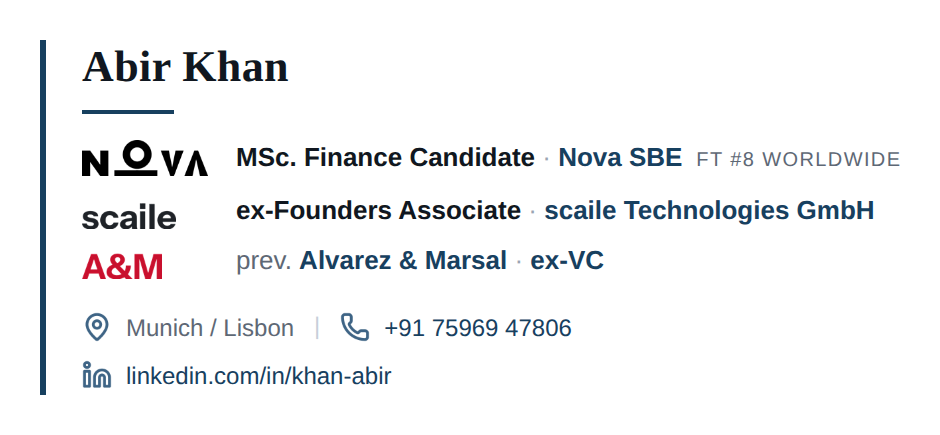

# Email signature — Abir Khan

A table-based HTML email signature with logo marks and contact icons, built to
survive Gmail, Outlook and Apple Mail without external requests.

Open **`dist/preview.html`** in a browser to see it, copy it, and read the
per-client install steps.




## Which file to use

| File | Use it when |
| --- | --- |
| `dist/signature.html` | Default. Logo marks and contact icons, 26.0 KB. |
| `dist/signature-minimal.html` | Recipients block images, or you want a 3.4 KB signature. Same content and typography, zero images. |
| `dist/signature.txt` | Plain-text mail, ATS forms, anywhere HTML is rejected. |

Install by **pasting**, not importing — every mail client rewrites the markup it
stores, and pasting is the path each one supports. `dist/preview.html` has a
copy button and the exact steps for Gmail, Outlook and Apple Mail.

## Swapping in real logos

The **Nova SBE** mark is the official wordmark redrawn from the logo — the
ringed O with its bar, and the angular N/V/A. **scaile** and **A&M** are
placeholders: their names set in Instrument Sans at the same cap height and
baseline, because the network policy in the environment this was built in
blocked both company sites.

Marks are scaled to the signature's 18px line height and keep their own aspect
ratio, so wide wordmarks work as well as square icons. The left gutter sizes
itself to the widest mark.

To drop in real files:

```bash
python3 embed_logo.py novasbe ~/Downloads/nova-sbe.png
python3 embed_logo.py scaile  ~/Downloads/scaile.svg
python3 embed_logo.py am      ~/Downloads/am.png
python3 build_signature.py            # re-embed and rebuild dist/
```

`embed_logo.py` scales the image to the 18px line height preserving aspect
ratio. Pass `--bg` to sit it on a rounded tile, `--pad` to inset it. PNG, JPG,
WEBP and SVG are all accepted.

Check each organisation's brand guidelines before putting its actual logo in
personal correspondence — some permit it for affiliates, some don't.

## Rebuilding

```bash
pip install pillow cairosvg
python3 build_assets.py        # rasterise icons + monogram marks -> assets/
python3 build_signature.py     # build the three variants + preview -> dist/
```

Content and colours live at the top of `build_signature.py`. Change them there
and rebuild rather than editing generated HTML.

## Why the markup looks the way it does

Email clients are not browsers. Outlook renders through Word, Gmail strips
`<style>` blocks and `<head>`, and most clients drop SVG. So:

- **Tables, not flexbox or grid** — the only layout primitive with full support.
- **Inline styles only** — no stylesheet survives Gmail.
- **Base64 PNGs, not SVG** — SVG is stripped nearly everywhere; base64 means no
  external requests, no image-hosting, and nothing for a proxy to break. Images
  are rendered at 3× display size so they stay sharp on retina screens.
- **Width and height as attributes *and* inline styles** — Outlook honours the
  attributes, everything else honours the CSS.
- **Georgia and Helvetica** — web-safe stacks; webfonts don't load in most
  clients.
- **Mid-tone icon colour** (`#3E6485`) — stays legible when a client forces its
  own dark mode. The logo tiles carry their own backgrounds, so they can't
  vanish either.

## Layout

```
signature/
├─ build_assets.py       rasterises Lucide icons + draws the monogram marks
├─ build_signature.py    content, palette, and the markup builder
├─ embed_logo.py         swaps a real logo file into a mark
├─ src/
│  ├─ page.html          template for the preview page
│  └─ *.svg              Lucide source icons (MIT)
├─ assets/               generated PNGs, 54×54 marks and 45×45 icons
└─ dist/                 generated — the files you actually use
```

Contact icons are [Lucide](https://lucide.dev) (MIT). Monogram marks are set in
[Instrument Sans](https://fonts.google.com/specimen/Instrument+Sans) (OFL).
